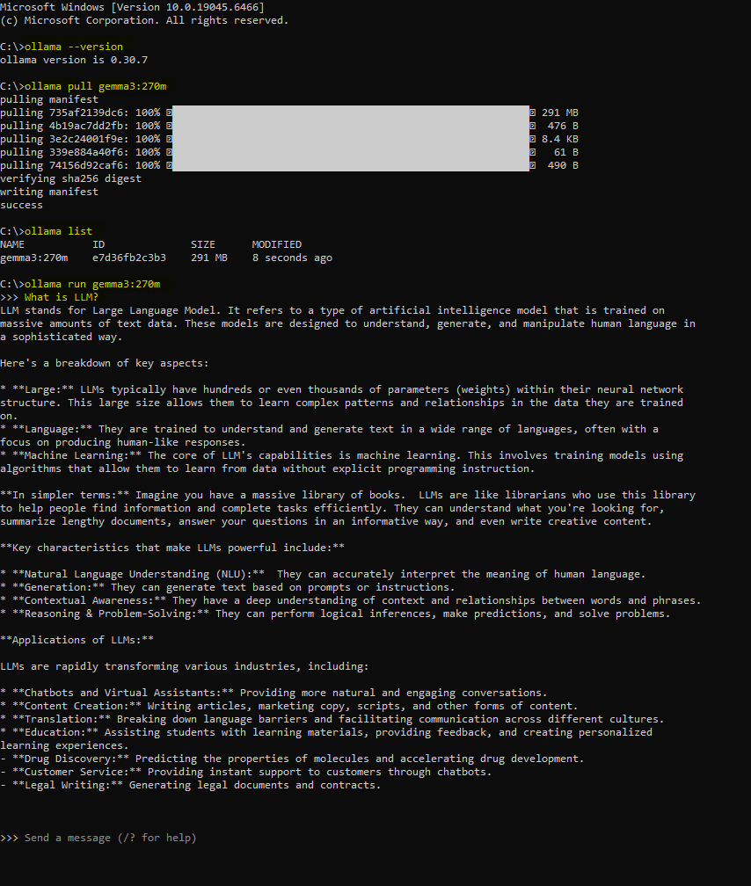

# 01. Chạy AI trên máy của bạn

1. LLM là gì?
2. Hai phần: phần mềm và mô hình (model)
3. Phần mềm chạy LLM cục bộ (giống phần mềm nghe nhạc)
4. Mô hình mã nguồn mở (cái "nội dung")
5. Bắt đầu: cài Ollama và chạy mô hình đầu tiên
6. Cài và chạy được bao nhiêu mô hình cùng lúc?
7. Chọn mô hình theo cấu hình máy
8. Chạy hai mô hình Gemma cùng lúc
9. Bảng tra nhanh

---

## 1. LLM là gì?

**LLM** = *Large Language Model* = mô hình ngôn ngữ lớn.

Đây là "bộ não AI" biết đọc hiểu và viết ra chữ, giống thứ đứng sau ChatGPT, Gemini hay Claude. Bạn gõ câu hỏi, nó trả lời.

Điều quan trọng cần nhớ ngay từ đầu: một AI hoàn chỉnh thật ra gồm **hai phần tách rời** ghép lại:

- Phần "bộ não" → chính là **mô hình (model)**
- Phần "máy chạy" bộ não đó → chính là **phần mềm**

Hai phần này khác nhau. Đó là lý do bạn cần hiểu cả hai.

---

## 2. Hai phần: phần mềm và mô hình

Cách dễ hình dung nhất là **phần mềm nghe nhạc** như Windows Media Player trên Windows hoặc Music trên macOS:

| Thế giới âm nhạc | Thế giới AI |
|---|---|
| **Phần mềm nghe nhạc** (app nghe nhạc) | **Phần mềm chạy LLM** (Ollama, LM Studio...) |
| **File bài hát** (`.mp3`) | **Mô hình AI** (Gemma, Llama...) |

Nguyên tắc cốt lõi:

> **Phần mềm** giống *phần mềm nghe nhạc*. **Mô hình** giống *file bài hát* để mở.

- Một phần mềm nghe nhạc phát được nhiều bài hát.
- Tương tự, **một phần mềm như Ollama chạy được nhiều mô hình khác nhau** — hôm nay Gemma, mai Qwen, tùy bạn.

Bạn cần **cả hai** mới dùng được. Có phần mềm nghe nhạc mà không có bài hát thì không nghe được gì; có file nhạc mà không có phần mềm nghe nhạc thì cũng không mở được.

---

## 3. Phần mềm chạy LLM local 

### Local nghĩa là gì?

**Local** nghĩa là chạy **ngay trên máy của bạn**, không gửi gì lên internet.

Khác với ChatGPT (mọi thứ bạn gõ đều gửi lên server của công ty ở xa), chạy local giữ **mọi thứ trong máy bạn**:

- Riêng tư: dữ liệu không rời khỏi máy
- Miễn phí: không trả phí hằng tháng
- Offline: rớt mạng vẫn chạy
- Đánh đổi: tốc độ và độ thông minh phụ thuộc vào sức mạnh máy của bạn

### Phần mềm này làm gì?

Nó lo hết phần kỹ thuật phức tạp:

- Tải mô hình về máy
- Nạp mô hình vào bộ nhớ (RAM)
- Nhận câu hỏi của bạn và đưa cho mô hình xử lý
- Trả kết quả về cho bạn

### 4 phần mềm phổ biến nhất

Đây là những cái người mới hay gặp nhất. Chọn một cái để bắt đầu; tất cả đều chạy chung các mô hình mã nguồn mở (open source).

| Phần mềm | Giao diện | Hợp với ai |
|---|---|---|
| **Ollama** | Dòng lệnh | Đơn giản, ổn định, nhẹ; dễ "cài là chạy" nhất |
| **LM Studio** | Đồ họa (GUI) | Người thích bấm chuột hơn gõ lệnh; dễ tìm và thử mô hình |
| **Jan** | Đồ họa (GUI) | Bản mã nguồn mở, gọn, thay thế cho LM Studio |
| **GPT4All** | Đồ họa (GUI) | Chạy được trên máy yếu; có thêm tùy chọn Python |

> Cách làm phổ biến: dùng phần mềm có giao diện như *LM Studio* để tìm và thử mô hình, rồi chuyển sang *Ollama* khi đã quen. (Các công cụ nâng cao như llama.cpp, vLLM, LocalAI dành cho người chuyên sâu, chưa cần vội.)

---

## 4. Mô hình mã nguồn mở (open-source model)

### Nhắc lại "model"

Model là **"bộ não AI"**, phần thật sự suy nghĩ và trả lời. Trong phép so sánh, nó là **file bài hát** mà phần mềm nghe nhạc mở.

### "Mã nguồn mở" (open-source) nghĩa là gì?

**Mã nguồn mở** (còn gọi *open-weight*) nghĩa là công ty tạo ra mô hình **công khai cho mọi người tải về dùng miễn phí**, thường cho cả mục đích cá nhân lẫn thương mại.

Ngược lại là mô hình **đóng (closed)** như GPT của OpenAI hay Claude của Anthropic: bạn chỉ dùng được qua dịch vụ của họ, **không tải về máy được**.

> **Muốn chạy AI local trên máy mình, bạn bắt buộc phải dùng open-source model**, vì mô hình đóng không cho tải về.

### Vài open-source model nổi tiếng

| Model | Made by | Note |
|---|---|---|
| **Gemma** | Google | Nhẹ, hiệu quả, hợp máy yếu |
| **Llama** | Meta (Facebook) | Phổ biến, nhiều phiên bản |
| **Qwen** | Alibaba | Mạnh, hỗ trợ đa ngôn ngữ tốt (cả tiếng Việt) |
| **Phi** | Microsoft | Rất nhẹ, chạy được máy cấu hình thấp |
| **DeepSeek** | DeepSeek | Mạnh về suy luận và lập trình |
| **Mistral** | Mistral AI | Cân bằng tốt, hay dùng trong sản phẩm thực tế |

### Một mô hình có nhiều "sizes"

Bạn sẽ thấy tên kiểu `gemma3:1b`, `gemma3:4b`, `qwen3:8b`. Chữ **"b"** là viết tắt của *billion* (tỉ), tức **số tham số (parameters)**, hiểu nôm na là **"bộ não lớn cỡ nào"**:

- Số càng lớn càng thông minh hơn, nhưng cần máy mạnh hơn và chạy chậm hơn.
- Số càng nhỏ thì càng "kém thông minh" hơn chút, nhưng nhẹ và nhanh trên máy yếu.

Ví dụ: `4b` nghĩa là mô hình có 4 tỉ tham số.

> Còn một thứ tên là **quantization** (thường thấy ký hiệu `Q4`), là kỹ thuật "nén" mô hình cho nhẹ đi để chạy được trên máy thường. Phần mềm như Ollama tự làm việc này, bạn **không cần lo**.

---

## 5. Bắt đầu: cài Ollama và chạy model đầu tiên

Phần này là thực hành. Làm xong là bạn đã cài Ollama và đang chat với một mô hình thật.

### Bước 1: Cài Ollama

**Windows**
1. Vào https://ollama.com/download
2. Tải file cài cho Windows (`OllamaSetup.exe`) rồi chạy nó.
3. Cài xong, Ollama chạy ngầm trong máy. Mở **PowerShell** (hoặc Command Prompt) để gõ lệnh.

Nếu bạn mới dùng Windows và chưa biết mở PowerShell hoặc Command Prompt:

1. Nhấn phím **Windows** trên bàn phím, hoặc bấm nút **Start** ở góc dưới màn hình.
2. Gõ `PowerShell` rồi nhấn **Enter** để mở PowerShell.
3. Nếu muốn dùng Command Prompt, gõ `cmd` rồi nhấn **Enter**.
4. Khi cửa sổ màu đen hoặc xanh hiện ra, bạn có thể gõ các lệnh như `ollama --version`.



**Mac**
1. Vào https://ollama.com/download
2. Tải bản cho macOS, mở file `.zip`, kéo **Ollama** vào thư mục Applications.
3. Mở nó một lần (nó hiện ở thanh menu trên cùng). Sau đó mở app **Terminal** để gõ lệnh.

Kiểm tra đã cài đúng chưa (lệnh giống nhau trên cả hai):

```
ollama --version
```

### Bước 2: Xem các mô hình mã nguồn mở có sẵn

Ollama có một thư viện mô hình công khai để bạn tải.

- **Xem trên web:** vào https://ollama.com/library để thấy tất cả mô hình, các cỡ, và tên tag chính xác (như `gemma3:270m`).
- **Xem mô hình bạn đã cài trong máy:**

```
ollama list
```

Lưu ý: `ollama list` chỉ hiện mô hình đã có trong máy. Muốn tìm mô hình mới để tải, dùng thư viện trên web ở trên.

### Bước 3: Cài gemma3:270m

Lệnh này tải mô hình Gemma tí hon 270 triệu tham số của Google (khoảng 290 MB):

```
ollama pull gemma3:270m
```

### Bước 4: Chat với nó

```
ollama run gemma3:270m
```

Lệnh này mở khung chat. Gõ một câu, nhấn Enter, mô hình trả lời. Muốn thoát chat, gõ:

```
/bye
```

### Ví dụ trên PowerShell (Windows)

Toàn bộ quy trình trên Windows PowerShell, từ đầu đến cuối:

```powershell
# Kiem tra Ollama da cai chua
ollama --version

# Tai mo hinh Gemma ti hon
ollama pull gemma3:270m

# Xem nhung gi da cai trong may
ollama list

# Bat dau chat (go /bye de thoat)
ollama run gemma3:270m
```

Bạn cũng có thể hỏi một câu mà không cần vào chế độ chat:

```powershell
ollama run gemma3:270m "Giai thich LLM la gi trong mot cau."
```

> `gemma3:270m` rất nhỏ, nên hãy hỏi ngắn và đơn giản. Muốn câu trả lời tốt hơn, hãy cài một mô hình lớn hơn sau (xem mục 7) và chạy y hệt cách trên.

---

## 6. Cài và chạy được bao nhiêu mô hình cùng lúc?

### a) Cài (tải về) — gần như không giới hạn

"Cài" một mô hình chỉ là **lưu file của nó vào ổ cứng**. Giới hạn duy nhất là **dung lượng ổ cứng**.

Mỗi mô hình nhỏ chỉ vài GB, nên trên một ổ bình thường bạn cài được **hàng chục, thậm chí hàng trăm** mô hình. Chúng chỉ nằm yên trên ổ, **không tốn RAM** khi chưa chạy. (Theo phép so sánh phần mềm nghe nhạc: đây là số *bài hát bạn lưu trong máy*, lưu bao nhiêu cũng được.)

### b) Chạy cùng lúc (nạp vào bộ nhớ) — giới hạn bởi bộ nhớ

Để thật sự *chạy*, mô hình phải được **nạp vào bộ nhớ** (RAM nếu dùng CPU, hoặc VRAM nếu dùng GPU), mà bộ nhớ thì có hạn.

Về kỹ thuật, phần mềm như Ollama **có thể** nạp nhiều mô hình cùng lúc. Mặc định nó cho phép tối đa 3 mô hình nạp đồng thời trên máy chạy CPU — **nhưng với điều kiện chúng vừa đủ trong bộ nhớ khả dụng**. Chính điều kiện đó là giới hạn thật.

Vậy con số "3" chỉ là *trần cho phép*; giới hạn thật là **RAM của bạn**. Máy mạnh (nhiều RAM/VRAM) chạy được vài cái cùng lúc; máy yếu chỉ chạy một.

### c) Chuyển qua lại giữa các mô hình — phần mềm tự lo

Tin tốt: bạn **không phải tự đóng/mở** mô hình. Ollama tự quản lý. Nếu một yêu cầu cần mô hình mới mà bộ nhớ không đủ, Ollama **tự bỏ nạp (unload) các mô hình đang rảnh để dọn chỗ**, rồi nạp mô hình mới.

Tức là khi bạn gọi mô hình A, nó nạp A. Khi bạn gọi mô hình B mà bộ nhớ không chứa nổi cả hai, nó âm thầm bỏ A và nạp B. Quá trình này diễn ra ngầm, chỉ tốn vài giây nạp lại. Dùng lệnh `ollama ps` để xem mô hình nào đang trong bộ nhớ.

---

## 7. Chọn mô hình theo cấu hình máy

Yếu tố quan trọng nhất là **bộ nhớ**: RAM hệ thống nếu bạn không có card đồ họa rời, hoặc **VRAM** (bộ nhớ trên GPU rời) nếu có. GPU nhanh hơn CPU rất nhiều cho việc này, nên mô hình nào vừa trong VRAM sẽ chạy mượt hơn hẳn. Luôn dùng bản **quantization** mặc định `Q4` để tiết kiệm bộ nhớ.

Dưới đây là bốn nhóm máy phổ biến. Tìm nhóm gần với máy bạn nhất.

### Nhóm 1: Không có GPU rời (chỉ CPU + RAM)

Laptop văn phòng, máy bàn đời cũ, máy chỉ có card tích hợp. Mọi thứ chạy bằng CPU, được nhưng chậm, nên giữ mô hình nhỏ.

- Vùng ngon nhất: mô hình **1B đến 4B** → `gemma3:1b`, `gemma3:4b`, `llama3.2:3b`, `qwen3:4b`
- Chạy được nhưng chậm: một mô hình **7B đến 8B** → `qwen3:8b`
- Tránh: mọi thứ lớn hơn

### Nhóm 2: GPU phổ thông/tầm trung (khoảng 6 đến 8 GB VRAM)

Nhiều laptop gaming và card bàn giá tốt (ví dụ dòng RTX 3050/3060).

- Thoải mái: mô hình **7B đến 8B** → `qwen3:8b`, `llama3.1:8b`, `phi-4`
- Có thể: lên tới khoảng **12B đến 14B** (bản nén) → `gemma3:12b`

### Nhóm 3: GPU cao cấp (khoảng 16 đến 24 GB VRAM)

Card bàn cho dân chơi (ví dụ dòng RTX 3090/4090).

- Thoải mái: mô hình **27B đến 32B** → `gemma3:27b`, `qwen2.5-coder:32b`
- Được nhưng chậm hơn: mô hình **70B** ở mức Q4 → `llama3.3:70b`

### Nhóm 4: Mac chip Apple Silicon (dòng M, bộ nhớ hợp nhất)

Trên các máy Mac này, CPU và GPU **dùng chung bộ nhớ**, nên tổng RAM là thứ quyết định. Chúng mạnh đáng ngạc nhiên so với kích thước.

- 16 GB RAM: thoải mái với mô hình **7B đến 14B**
- 32 GB trở lên: chạy được mô hình **27B đến 70B**
- Mẹo: runtime **Apple MLX** là lựa chọn nhanh nhất trên các chip này, dù Ollama vẫn chạy tốt.

### Quy tắc chung

> Chọn **mô hình lớn nhất mà vẫn vừa bộ nhớ và còn dư chỗ**. Nếu trả lời quá chậm hoặc máy ì, lùi xuống một cỡ. Nếu chạy nhẹ nhàng, thử lên cỡ kế tiếp.

---

## 8. Chạy hai mô hình Gemma cùng lúc

Một ví dụ thực tế cho người mới: cài **và chạy** đồng thời cả `gemma3:270m` (mô hình tí hon ở mục 5) lẫn `gemma3:4b` (mô hình 4 tỉ tham số). Cách này chạy được trên hầu hết máy vì mô hình tí hon quá nhẹ.

### Cài cả hai

Cài chỉ là tải file về ổ, mà hai cái này đều nhỏ:

- `gemma3:270m` → khoảng 290 MB
- `gemma3:4b` → khoảng 3,3 GB

Tải bằng:

```
ollama pull gemma3:270m
ollama pull gemma3:4b
```

Xem mọi thứ đã cài trên ổ:

```
ollama list
```

### Chạy / gọi ra dùng

Chạy mô hình theo tên (gõ `/bye` để thoát chat):

```
ollama run gemma3:270m
```

Muốn dùng cái kia:

```
ollama run gemma3:4b
```

### Cả hai nạp vào bộ nhớ cùng lúc được không? Thường là được

Bộ nhớ là giới hạn khi chạy nhiều mô hình cùng lúc, nhưng `gemma3:270m` nhỏ tới mức **cả hai vẫn vừa thoải mái** ngay cả trên máy khiêm tốn. Tính sơ: khoảng 300 MB cho cái tí hon + khoảng 4 GB cho cái 4b, tổng dưới 5 GB. Ollama mặc định cho phép nạp tới 3 mô hình cùng lúc trên máy CPU, nên nó giữ cả hai trong bộ nhớ nếu bạn dùng cả hai.

Xem mô hình nào đang nằm **trong bộ nhớ** (không phải chỉ cài trên ổ):

```
ollama ps
```

Lệnh này hiện từng mô hình đang nạp, kích thước, và bộ đếm ngược tới lúc tự bỏ nạp (Ollama giải phóng một mô hình sau khoảng 5 phút không dùng).

### Vì sao cặp này hữu ích

- Dùng `gemma3:270m` cho việc nhanh, đơn giản — cực nhanh nhưng chất lượng hạn chế.
- Chuyển sang `gemma3:4b` khi cần câu trả lời tốt hơn — chậm hơn nhưng thông minh hơn rõ. Đây là mô hình "chính" hằng ngày của bạn.

Bạn có thể mở hai cửa sổ terminal, mỗi cái chạy một mô hình, chúng cùng nằm trong bộ nhớ. Hoặc chỉ cần `run` cái nào bạn cần, để Ollama tự lo việc nạp và bỏ nạp.
